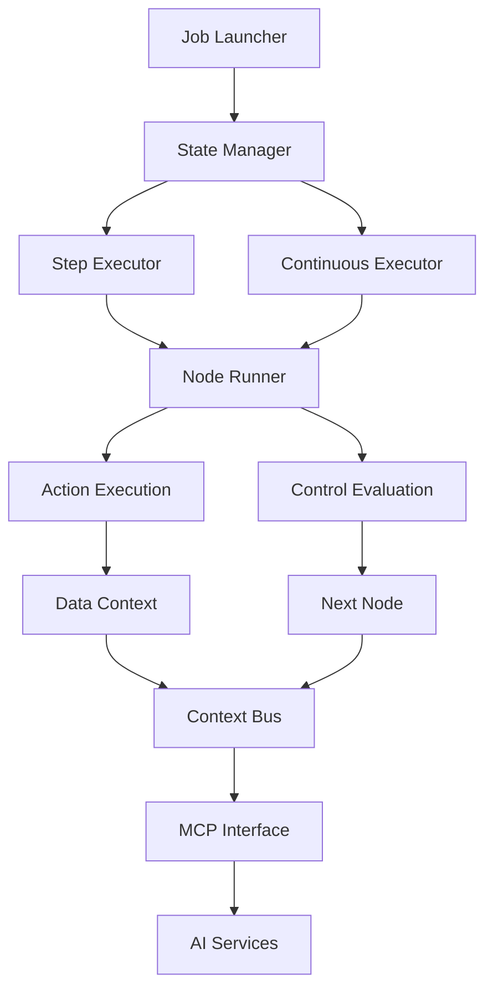

# Weboter Engine Architecture Design

## Core Principles
- **Observability**: Full execution context exposure
- **Controllability**: Granular execution control (step/stop/resume)
- **Extensibility**: MCP integration points
- **Resilience**: Error recovery with AI intervention

## Key Components



## Execution States
| State       | Description                          | AI Trigger             |
|-------------|--------------------------------------|------------------------|
| `IDLE`      | Ready for new job                    | Workflow generation    |
| `LOADED`    | Workflow ready                       | Pre-execution analysis |
| `RUNNING`   | Continuous execution                 | Monitoring             |
| `PAUSED`    | Stopped at breakpoint                | Step analysis          |
| `STEPPING`  | Manual step execution                | Context feedback       |
| `ERROR`     | Exception occurred                   | Error recovery         |

## MCP Integration Points
1. **Context Snapshots**
   - Serialized execution state streaming
   ```proto
   message ContextSnapshot {
       string job_id = 1;
       google.protobuf.Timestamp timestamp = 2;
       Node current_node = 3;
       map<string, Value> variables = 4;
       repeated NodeHistory history = 5;
   }
   ```

2. **AI Operation Interface**
   ```python
   class AIOperationService:
       def generate_workflow(self, prompt: str) -> Workflow:
           """AI generates new workflow config"""

       def suggest_repair(self, error_ctx: ErrorContext) -> RepairAction:
           """AI suggests repair strategy (retry/skip/rewrite)"""

       def modify_runtime(self, context_snap: ContextSnapshot,
                         modifications: NodeModifications) -> bool:
           """Apply AI-generated modifications to running execution"""
   ```

3. **Debug Event Hooks**
   | Hook Point         | Payload                         | Use Case                  |
   |--------------------|---------------------------------|--------------------------|
   | `pre_node_execute` | Current node metadata           | AI precondition checking  |
   | `post_node_execute`| Node output data               | Result validation        |
   | `on_node_error`    | Error stack + Variables state | AI diagnostics           |

## Next Steps
1. Define protobuf schema for context snapshots
2. Implement gRPC service stubs
3. Design context serialization format
4. Build dev-mode UI for manual stepping