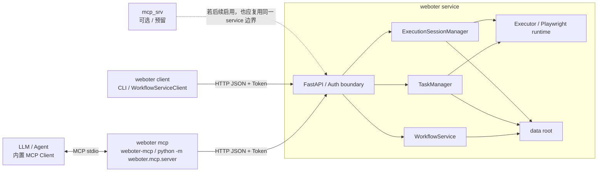

# Weboter MCP 架构设计

## 目标

本阶段的目标不是把 MCP 直接嵌进执行器，而是建立一套稳定的远程控制面，让 agent 能在执行会话中观察、介入、修改并导出 workflow，同时保留权限边界。

## 统一叫法

- `weboter service`：唯一执行面，负责 workflow 执行、任务管理、会话管理、日志与数据落盘
- `weboter client`：通过命令行或脚本直接调用 service 的部分，例如 `weboter service ...`、`weboter workflow ...`、`WorkflowServiceClient`
- `weboter mcp`：提供给 LLM / agent 使用的 MCP 入口，当前对应 `weboter-mcp` 或 `python -m weboter.mcp.server`

## 分层

整体分为三层：

1. `ExecutionSession` 会话层
   - 挂在 `Executor.step_one()` 前后
   - 保存节点级快照
   - 提供暂停、恢复、上下文修改、节点跳转、节点补丁、页面操作的执行入口
   - 在异常时进入 `guard_waiting` 状态，保留第一现场

2. `weboter service` 控制面
   - 基于 FastAPI 暴露任务、会话、日志和页面控制接口
   - session 相关能力通过 HTTP API 远程调用
    - 自身的监听地址、工作目录和鉴权由 service 侧独立决定

3. `weboter mcp`
   - 基于官方 Python `mcp` SDK 的 `FastMCP`
   - 默认使用 `stdio` 作为 MCP client 到 adapter 的传输方式
    - adapter 只通过 `WEBOTER_SERVICE_URL` / `WEBOTER_MCP_SERVICE_URL` 连接目标 service
   - 因此 agent 与 `weboter service` 可以不在同一环境

## 结构图



## 执行介入模型

`ExecutionSession` 在以下时机生成快照：

- workflow 加载完成
- 节点执行前
- 节点执行后
- 执行结束
- 执行异常进入 guard

会话支持以下介入动作：

- `pause`
- `interrupt_next`
- `resume`
- `abort`
- `set_context`
- `jump_to_node`
- `patch_node`
- `add_node`
- `read_workflow`
- `update_breakpoints`
- `clear_breakpoints`
- `export_workflow`
- `page_snapshot`
- `page_run_script`

这些动作不会在外部线程直接碰运行中的 Playwright 对象，而是通过会话命令队列回到执行线程自己的事件循环中执行。

其中有两点是为了满足 agent 调试而新增的：

1. `interrupt_next` 与 `breakpoints`
  - `pause` 只能在执行线程回到命令检查点时生效，无法保证停在目标节点前
  - 对于“还没启动就要停在第一个节点前”的场景，提交 workflow 时应直接携带 `pause_before_start`
  - `interrupt_next` 会在下一个节点执行前进入暂停态
  - `breakpoints` 支持按 `phase + node_id/node_name` 精确停靠，当前推荐默认使用 `before_step`

2. `page_run_script`
  - 不再要求 MCP 为 `click`、`fill`、`press`、`hover` 等动作各自暴露独立 tool
  - agent 通过单个受控脚本入口直接编写 Playwright 页面操作逻辑
  - service 侧负责脚本 AST 校验、超时控制和运行结果快照，避免控制面无限膨胀

## Guard Hook

当 `step_one()` 抛出异常时：

1. `Executor.run()` 调用 session hook 的 `on_error`
2. session 状态切到 `guard_waiting`
3. 当前 runtime、节点、页面状态被快照化
4. 外部 agent 可以读取日志、快照并下发修复命令
5. agent 可选择 `resume` 重试，或 `abort` 失败结束

## 权限边界

本阶段先实现两层边界：

1. Service 侧令牌鉴权
    - service 开启鉴权后，除 `/health`、`/docs`、`/openapi.json` 外的接口都要求 `X-Weboter-Token`
    - 外部 MCP adapter 不负责生成、发现或持久化这个 token；若需要访问受保护 service，应显式传入 `WEBOTER_API_TOKEN`

2. MCP profile
   - `readonly`: 只读任务、会话、日志和快照
  - `operator`: 在只读基础上允许会话控制、断点调试、workflow 修改和通用页面脚本
  - `admin`: 当前与 `operator` 接近，保留为后续增加更高风险操作的预留层

## 推荐的 Agent Debug 提交流程

1. 提交时就决定是否需要首节点停靠
  - 首次探索 workflow：`pause_before_start=true`
  - 已知目标节点：`breakpoints=[{"phase": "before_step", "node_id": "target"}]`
2. 从提交结果里的 `task.session_id` 直接进入会话调试
3. 用 `session_get`、`session_snapshots`、`session_workflow` 建立第一现场
4. 需要页面探索时，先 `page_snapshot`，再 `page_run_script`
5. 修改完成后再 `resume` 或 `abort`

## 会话与任务关系

- 一个 task 对应一个 session
- 当前实现中 `session_id == task_id`
- task 保存执行结果和日志路径
- session 保存执行现场、快照、当前节点和可介入状态

## 远程传输说明

`stdio` 只用于 MCP client 与 `weboter mcp` 进程之间。

真正的跨环境调用链是：

`LLM / Agent -> weboter mcp -> HTTP weboter service -> ExecutionSession`

因此只要 `weboter mcp` 能访问 `WEBOTER_SERVICE_URL` 指向的 service，agent 和 service 就不必部署在同一环境。

## 客户端启动面的拆分结论

从客户端启动 MCP 的角度，问题的关键不是“要不要再造一个新的 `mcp-srv` 进程”，而是“不要让 `weboter mcp` 带上执行端依赖”。

当前更合理的拆分是：

- `weboter mcp` 作为轻量 adapter，只保留 `mcp` 和 HTTP client 能力
- `weboter service` 作为重执行面，持有 FastAPI、Playwright 和 workflow 运行时

因此这里应该拆的是发布物和依赖面，而不是再额外引入一个新的重型 MCP server / CLI 双角色。

如果后续真的需要继续拆分，也应优先考虑：

- 单独发布轻量 `weboter mcp` 包
- 单独发布执行端 `weboter-service` 包

而不是让客户端启动路径继续携带 Playwright 或浏览器安装逻辑。

## 导出配置

推荐使用如下 MCP 导入方式。

如果 MCP client、`weboter service` 和 `weboter` Python 包在同一个环境中，可以直接运行 module；下面这段 JSON 只负责启动 `weboter mcp` 并连接已启动的 service：

```json
{
  "mcpServers": {
    "weboter": {
      "command": "python",
      "args": [
        "-m",
        "weboter.mcp.server"
      ],
      "env": {
        "WEBOTER_SERVICE_URL": "http://127.0.0.1:34567",
        "WEBOTER_MCP_PROFILE": "operator",
        "WEBOTER_MCP_TRANSPORT": "stdio",
        "WEBOTER_MCP_CALLER_NAME": "mcp"
      }
    }
  }
}
```

如果 agent 跑在 Windows，而 Weboter 运行在 WSL 中，应改为通过 `wsl.exe` 进入 WSL 后再启动 `weboter mcp`。示例：

```json
{
  "mcpServers": {
    "weboter": {
      "command": "C:\\Windows\\System32\\wsl.exe",
      "args": [
        "-d",
        "Debian",
        "bash",
        "-lc",
        "cd /path/to/weboter && . .venv/bin/activate && WEBOTER_SERVICE_URL=http://127.0.0.1:34567 WEBOTER_MCP_PROFILE=operator WEBOTER_MCP_TRANSPORT=stdio WEBOTER_MCP_CALLER_NAME=mcp python -m weboter.mcp.server"
      ]
    }
  }
}
```

这条边界需要保持简单明确：`weboter service` 如何启动、监听在哪、token 是什么，都由 service 自己负责；`weboter mcp` 只拿 `WEBOTER_SERVICE_URL` 和可选 `WEBOTER_API_TOKEN` 进行连接。

## 后续可继续扩展的部分

- 更细粒度的权限作用域，如按 task/session 限制
- 任务取消与回滚
- 页面 DOM diff / HAR / console 等更强快照
- 会话内 workflow 变更的审批与保存策略
- SSE 或 streamable-http 形式的 MCP adapter 部署